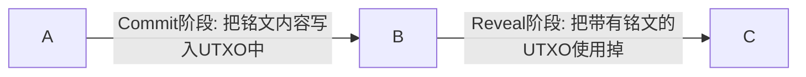

Ordinals提出到现在才半年时间，3月份开始炒作，如`NFT`,`BRC20`吸引了一大批投机分子追捧。市场的起伏有市场发展特有规律，BTC的生态会复刻以太坊的生态的繁荣历史吗? Ordinals能够存在多久？如何解决BTC高昂的手续费…… 等等，这些问题，没有人能够给出明确的答案。


单纯从技术角度看，Ordinals的“铭文”技术在2014年左右就已经出现，即基于`OP_RETURN`操作实现的，早期的 `Omni-USDT`代币就是基于此开发的。如今的Ordinals使用的是基于比特币最新的Taproot升级后的 `Tapscript`实现，并结合了`Segwit`隔离见证技术。


技术实现细节方面，我们会在下文依次展开细说。


本文分几个模块：

- Ordinals的`Inscription`原理
- Ordinals的序数理论
- 实践：ordinals的`inscribe`(铭刻)的源码分析
- Ordinals目前的生态
- ordinals未来展望


## Ordinals的`Inscription`原理

- 官方文档： https://docs.ordinals.com/inscriptions.html

- 比特币脚本：https://en.bitcoin.it/wiki/Script

|Word|	Opcode	|Hex|	Input|	Output|	Description
|----|-----|-------|---------|---------|--------
| `OP_0, OP_FALSE`	|0 |	0x00|	Nothing.|	(empty value) |	An empty array of bytes is pushed onto the stack. (This is not a no-op: an item is added to the stack.)
|`OP_IF`|	99|	0x63|	<expression> if [statements] [else [statements]]* endif|	|If the top stack value is not False, the statements are executed. The top stack value is removed.

```
<signature>

OP_FALSE
OP_IF
    OP_PUSH "ord"
    OP_1
    OP_PUSH "text/plain;charset=utf-8"
    OP_0
    OP_PUSH "Hello, world!"
OP_ENDIF

<public key>
```

- `<signature>` 是交易签名相关内容; `<public key>`是公钥相关内容，用于验证签名的有效性

- `OP_FALSE` 会把一个空数组压入(`push`)栈顶，注意这边是有 push 东西的，只是它是空的。
-  `OP_IF` 检查栈顶，如果为 `true` 才会做接下来的事情，因为前面 `OP_FALSE` 的动作，导致这个 if 不会成立。
  接下来 `OP_PUSH` … 等一系列操作都会被忽略，因为上一个 if 条件没有达成。
- `OP_ENDIF` 结束这个 if 区块。
- 可以看出来中间这些操作因为 `OP_IF` **一定不会成立**，所以等于什麽状态都没改变，于是就可以把图片的完整资料都放在 OP_IF 裡面而**不影响本来 Bitcoin script 的 validation**，多亏了 Taproot 升级，script 现在是没有大小上限了，所以只要 transaction 的大小小于 block 的大小 (4 MB)，script 你要多大都可以，也就是说我们可以达到**类似 OP_RETURN 的效果**，把无关的资料放上去 Bitcoin 却还没有 80 bytes 的大小限制了。大小限制了。
- 其中 `OP_0`后面跟随的是incribe的内容，每个块不能超过`520 bytes`, 如果超过`520字节`则需要进行`分块`,每个块之间插入`OP_0`间隔开


综上， Inscribe(铭刻)就是通过在交易验证数据中间，插入一个**不会影响**交易验证结果的内容（铭文），inscription的内容可以是任意类型，比如：文本，图片，视频，音频等等。


## Ordinals的序数理论

- 官方文档： https://docs.ordinals.com/overview.html

- 简述：
  - BTC总量恒定为`2100 BTC`
  - `1 BTC = 100000000 satoshi`(聪，致敬中本聪)
  - 因此总的`sat`(satoshi的简写)是 `2100 * 10^8`, 即 `2100,0000,0000`个`sat`
  - 产生新的`sat`的方式只有一个，那就是挖矿（PoW工作量证明）


## 实践：ordinals的`inscribe`(铭刻)的源码分析

首先，我们大概了解一下`inscribe`的流程

- `Commit`阶段： 将铭文写入UTXO,这个UTXO的接受地址必须是`Taproot(P2TR)`类型,因为需要用到`Tapscript`
- `Reveal`阶段： 使用掉UTXO，并转给目的接收地址, 目的接受地址必须也是`Taproot(P2TR)`




先分析inscribe命令的主流程：

  [inscribe入口函数](https://github.com/youngqqcn/ord/blob/master/src/subcommand/wallet/inscribe.rs#L56)

```rust
pub(crate) fn run(self, options: Options) -> Result {

    // 读取文件获取获取铭刻内容
    let inscription = Inscription::from_file(options.chain(), &self.file)?;

    // 更新index索引
    let index = Index::open(&options)?;
    index.update()?;

    // 加载rpc和钱包
    let client = options.bitcoin_rpc_client_for_wallet_command(false)?;

    // 获取钱包utxos集合
    let mut utxos = index.get_unspent_outputs(Wallet::load(&options)?)?;

    // 获取已有的铭刻
    let inscriptions = index.get_inscriptions(None)?;

    // commit交易找零金额
    let commit_tx_change = [get_change_address(&client)?, get_change_address(&client)?];

    // 铭文接受者地址
    let reveal_tx_destination = self
      .destination
      .map(Ok)
      .unwrap_or_else(|| get_change_address(&client))?;

    // 构造
    //     未签名的commit_tx
    //     已签名的reveal_tx（taproot）交易
    //     已经恢复密钥对（因为commit_tx的taproot输出，
    //        是一个临时创建中间密钥对(地址)，因此，reveal_tx可以直接用这个“临时”密钥对的私钥进行签名，
    //        恢复密钥对用于对交易的恢复，不必细究
    let (unsigned_commit_tx, reveal_tx, recovery_key_pair) =
      Inscribe::create_inscription_transactions(
        self.satpoint,
        inscription,
        inscriptions,
        options.chain().network(),
        utxos.clone(),
        commit_tx_change,
        reveal_tx_destination,
        self.commit_fee_rate.unwrap_or(self.fee_rate),
        self.fee_rate,
        self.no_limit,
      )?;

    // 将 commit_tx的输出，亦即 reveal_tx的输入，插入index保存，
    utxos.insert(
      reveal_tx.input[0].previous_output,
      Amount::from_sat(
        unsigned_commit_tx.output[reveal_tx.input[0].previous_output.vout as usize].value,
      ),
    );

    // commit_tx 和 reveal_tx 总共的交易矿工费
    let fees = Self::calculate_fee(&unsigned_commit_tx, &utxos) + Self::calculate_fee(&reveal_tx, &utxos);

    if self.dry_run {
        // ======== 虚晃一枪， 不上链 ==============
        print_json(Output {
            commit: unsigned_commit_tx.txid(),
            reveal: reveal_tx.txid(),
            inscription: reveal_tx.txid().into(),
            fees,
        })?;
    } else {
        // ========== 动真格的 ， 上链 ============

        // 是否备份上面的“临时”密钥对的recovery_key
        if !self.no_backup {
            Inscribe::backup_recovery_key(&client, recovery_key_pair, options.chain().network())?;
        }

        // 对未签名的commit_tx进行签名
        let signed_raw_commit_tx = client
            .sign_raw_transaction_with_wallet(&unsigned_commit_tx, None, None)?
            .hex;

        // 广播已签名的commit_tx交易
        let commit = client
            .send_raw_transaction(&signed_raw_commit_tx)
            .context("Failed to send commit transaction")?;

        // 广播已签名的reveal_tx交易
        let reveal = client
            .send_raw_transaction(&reveal_tx)
            .context("Failed to send reveal transaction")?;

        // 打印结果
        print_json(Output {
            commit,
            reveal,
            inscription: reveal.into(),
            fees,
        })?;
    };

    Ok(())
  }
```


接着，我们来分析构造  `commit_tx` 以及 `reveal_tx` 的细节

- [src/subcommand/wallet/inscribe.rs](https://github.com/youngqqcn/ord/blob/master/src/subcommand/wallet/inscribe.rs)


```rust
fn create_inscription_transactions(
    satpoint: Option<SatPoint>,                         // 可指定使用某个 UTXO来进行 inscribe
    inscription: Inscription,                           // 铭刻内容
    inscriptions: BTreeMap<SatPoint, InscriptionId>,    // 已铭刻的集合
    network: Network,                                   // 比特币网络类型
    utxos: BTreeMap<OutPoint, Amount>,                  // utxo集合
    change: [Address; 2],                               // commit_tx交易找零地址
    destination: Address,                               // 铭文接收地址
    commit_fee_rate: FeeRate,                           // commit_tx 费率
    reveal_fee_rate: FeeRate,                           // reveal_tx 费率
    no_limit: bool,                                     // 是否限制reveal交易weight权重
) -> Result<(Transaction, Transaction, TweakedKeyPair)> {

    // 1) 获取进行铭刻UTXO
    let satpoint = if let Some(satpoint) = satpoint {
        // 如果指定来UTXO, 则直接使用指定的utxo进行铭刻
        satpoint
    } else {
        // 如果没有指定utxo, 则在utxos集合中找一个没有铭刻过的utxo

        let inscribed_utxos = inscriptions
        .keys()
        .map(|satpoint| satpoint.outpoint)
        .collect::<BTreeSet<OutPoint>>();

        utxos
        .keys()
        .find(|outpoint| !inscribed_utxos.contains(outpoint))
        .map(|outpoint| SatPoint {
            outpoint: *outpoint,
            offset: 0,
        })
        .ok_or_else(|| anyhow!("wallet contains no cardinal utxos"))?
    };

    // 2) 判断上一步的UTXO是否没有被铭刻过
    for (inscribed_satpoint, inscription_id) in &inscriptions {
        if inscribed_satpoint == &satpoint {
        return Err(anyhow!("sat at {} already inscribed", satpoint));
        }

        if inscribed_satpoint.outpoint == satpoint.outpoint {
        return Err(anyhow!(
            "utxo {} already inscribed with inscription {inscription_id} on sat {inscribed_satpoint}",
            satpoint.outpoint,
        ));
        }
    }

    // 3） 搞一个“临时”密钥对，用来作为 commit_tx的接受者，并作为 reveal_tx的花费（揭示）者
    let secp256k1 = Secp256k1::new();
    let key_pair = UntweakedKeyPair::new(&secp256k1, &mut rand::thread_rng());
    let (public_key, _parity) = XOnlyPublicKey::from_keypair(&key_pair);


    // 4） 按照ordinals官方的脚本规范，创建reveal脚本， 将铭文内容附加到reveal脚本
    let reveal_script = inscription.append_reveal_script(
        script::Builder::new()
        .push_slice(&public_key.serialize())
        .push_opcode(opcodes::all::OP_CHECKSIG),
    );

    // 5） 构造 taproot utxo 的花费交易， 关于taproot细节，不必西九
    let taproot_spend_info = TaprootBuilder::new()
        .add_leaf(0, reveal_script.clone())
        .expect("adding leaf should work")
        .finalize(&secp256k1, public_key)
        .expect("finalizing taproot builder should work");

    let control_block = taproot_spend_info
        .control_block(&(reveal_script.clone(), LeafVersion::TapScript))
        .expect("should compute control block");

    // 6） 根据上一步的信息，生产一个临时地址，接收包含 reveal脚本  的 交易输出(TXO)
    let commit_tx_address = Address::p2tr_tweaked(taproot_spend_info.output_key(), network);

    // 7) 根据交易字节数计算 reveal_tx 所需要的 手续费
    let (_, reveal_fee) = Self::build_reveal_transaction(
        &control_block,
        reveal_fee_rate,
        OutPoint::null(), // 并非空，而是 有字节数的，这样才能计算手续费费用
        TxOut {
        script_pubkey: destination.script_pubkey(),
        value: 0,
        },
        &reveal_script,
    );

    // 8） 因为 需要输出一个包含reveal脚本的 TXO, 所以， 其中一个 TXO是用于后面的 reveal操作的
    let unsigned_commit_tx = TransactionBuilder::build_transaction_with_value(
        satpoint,
        inscriptions,
        utxos,
        commit_tx_address.clone(),
        change,
        commit_fee_rate,

        // reveal交易手续费  +  铭文UTXO占位金额TARGET_POSTAGE，一般是 10000sat, 即 0.00010000 BTC
        // 为什么是  0.00010000 BTC ?   不可以是 0.00000546?
        reveal_fee + TransactionBuilder::TARGET_POSTAGE,
    )?;

    // 9） 获取交易输出大小，以及 交易输出， 用作构造 reveal_tx
    let (vout, output) = unsigned_commit_tx
        .output
        .iter()
        .enumerate()
        .find(|(_vout, output)| output.script_pubkey == commit_tx_address.script_pubkey())
        .expect("should find sat commit/inscription output");

    // 10) 根据 上一步的 commit_tx 的交易输出， 构造 reveal_tx
    let (mut reveal_tx, fee) = Self::build_reveal_transaction(
        &control_block,
        reveal_fee_rate,
        OutPoint {
        txid: unsigned_commit_tx.txid(),
        vout: vout.try_into().unwrap(),
        },
        TxOut {
        script_pubkey: destination.script_pubkey(),
        value: output.value, // 暂时用这个，下一步会修改
        },
        &reveal_script,
    );

    // 11) 修改 reveal_tx 的交易输出金额 为  value - fee , 正常来说修改后的交易输出金额为 TransactionBuilder::TARGET_POSTAGE
    reveal_tx.output[0].value = reveal_tx.output[0]
        .value
        .checked_sub(fee.to_sat())
        .context("commit transaction output value insufficient to pay transaction fee")?;

    // 12) 判断是否为 dust（尘埃）交易
    if reveal_tx.output[0].value < reveal_tx.output[0].script_pubkey.dust_value().to_sat() {
        bail!("commit transaction output would be dust");
    }

    // 13） 生成用于签名的hash
    let mut sighash_cache = SighashCache::new(&mut reveal_tx);

    let signature_hash = sighash_cache
        .taproot_script_spend_signature_hash(
        0,
        &Prevouts::All(&[output]),
        TapLeafHash::from_script(&reveal_script, LeafVersion::TapScript),
        SchnorrSighashType::Default,
        )
        .expect("signature hash should compute");

    // 14） 使用 第 3 步中的 “临时”密钥，对上一步生成的hash进行  schnorr签名
    let signature = secp256k1.sign_schnorr(
        &secp256k1::Message::from_slice(signature_hash.as_inner())
        .expect("should be cryptographically secure hash"),
        &key_pair,
    );

    // 15) 将 上一步生成的签名放到 见证数据中
    let witness = sighash_cache
        .witness_mut(0)
        .expect("getting mutable witness reference should work");
    witness.push(signature.as_ref());
    witness.push(reveal_script);
    witness.push(&control_block.serialize());

    // 16） 恢复密钥相关， 不必细究
    let recovery_key_pair = key_pair.tap_tweak(&secp256k1, taproot_spend_info.merkle_root());

    let (x_only_pub_key, _parity) = recovery_key_pair.to_inner().x_only_public_key();
    assert_eq!(
        Address::p2tr_tweaked(
        TweakedPublicKey::dangerous_assume_tweaked(x_only_pub_key),
        network,
        ),
        commit_tx_address
    );

    let reveal_weight = reveal_tx.weight();

    if !no_limit && reveal_weight > MAX_STANDARD_TX_WEIGHT.try_into().unwrap() {
        bail!(
        "reveal transaction weight greater than {MAX_STANDARD_TX_WEIGHT} (MAX_STANDARD_TX_WEIGHT): {reveal_weight}"
        );
    }

    // 返回
    Ok((unsigned_commit_tx, reveal_tx, recovery_key_pair))
}


//=================
pub(crate) fn append_reveal_script(&self, builder: script::Builder) -> Script {
    self.append_reveal_script_to_builder(builder).into_script()
}

fn append_reveal_script_to_builder(&self, mut builder: script::Builder) -> script::Builder {
    // 参考： https://docs.ordinals.com/inscriptions.html

    builder = builder
      .push_opcode(opcodes::OP_FALSE)
      .push_opcode(opcodes::all::OP_IF)
      .push_slice(PROTOCOL_ID);

    if let Some(content_type) = &self.content_type {
      builder = builder
        .push_slice(CONTENT_TYPE_TAG)
        .push_slice(content_type);
    }

    if let Some(body) = &self.body {
      builder = builder.push_slice(BODY_TAG);
      for chunk in body.chunks(520) {  // 按照520字节“切块“
        builder = builder.push_slice(chunk);
      }
    }

    builder.push_opcode(opcodes::all::OP_ENDIF)
  }
//=====================

```


## Ordinals未来展望

目前Ordinals存在几个问题：

- BTC手续费太贵
- 每个BTC NFT都是各自独立的，很难形成一个NFT集合


最近新出的 “递归铭文”(Recursion)，可以解决 “NFT集合“的问题。目前采用 html的形式


- 使用html将不同的nft进行汇总

```html
  <!DOCTYPE html>
<html lang="en">
    <head>
        <meta charset="UTF-8">
        <meta name="viewport" content="width=device-width, initial-scale=1.0">
        <title>Bitcoin Frogs</title>
    </head>
    <style>
        button:hover {
            background: #eee;
        }
        button {
            background: white;
            border: none;
            -webkit-tap-highlight-color: transparent;
            -webkit-touch-callout: none;
            -webkit-user-select: none;
            -khtmMl-user-select: none;
            -moz-user-select: none;
            -ms-user-select: none;
            user-select: none;
            cursor: pointer;
            font-size: 1.2rem;
            width: 3rem;
        }
        body {
            display: flex;
            flex-direction: column;
            margin: 0;
            height: 100vh;
            align-items: center;
        }
        div {
            display: flex;
            gap: 0;
            margin: 0.5rem;
            box-shadow: 0 8px 8px -4px rgba(0,0,0,.379);
            border-radius: 10rem;
            width: min-content;
            border: 2px black solid
        }
        img {
            object-fit: contain;
            overflow: hidden;
            width: 100%
        }
    </style>
    <body>
        <div>
            <button onclick="b.value=Math.max(0,Number(b.value)-1);setImg();" style="border-radius: 10rem 0 0 10rem;">◀</button>
            <input type="text" id="b" value="0" oninput="setImg();" style="bordeMr: none; border-radius: 0; text-align: center; width: max(4rem, 15vw); font-size: 1.8rem; line-height: 2.5rem;"/>
            <button onclick="b.value=Math.min(i.length-1,Number(b.value)+1);setImg();" style="border-radius: 0 10rem 10rem 0;">▶</button>
        </div>
        
        <script type="text/javascript">
            const i = ["783513f2044d48fdf303e58b1d8878a2394a695e2a9cac320c4823f09524a296i0", "45ac4aba0b8e73b96f8c35a850992b122f5540cc1d7f48be9c36706e2859f225i0", "52764b276ddeba366071Md892666fe7d5f904e00b7fd5c31319805037f1bb77e7i0", "7b133cbd9f8ea28c51641229b619be582d47b9e259806862034c6ab8be407114i0", "95e81ce702bf814b17554d604a61610d1e20c4f6daca4b7b22ea3f5fc0188316i0", "a8e05874f8baa053850895671da23d727952b60b068ebe47cbc9aa6acf6df9dci0", "b64368d62d49093e8d05320bf25b2c0dc595b19b5ff247d5d01bb5d5ce369b6ci0", "064b97a07fdd295af704ac542fce2a7920bec7418370af6bfc39b9ddb6f20ebbi0", "87b7f4c64d07274da6ad892923c22d5c95c52b970b6a18c775f9636cf57332c2i0", "1d79a5511e713905a61552abc5070438a0d6073c59b6768c52M8a4f6769c609dci0", "8563a79066bbcb2ca2049ac5c9a55c6463e54b8550a47c69466d8d88d403c522i0", "9aec45684a3ef8050a5327e4912c85ee1623d4701b46a5e45fa902b4c2b313c2i0", "0121e38d1310bdbfefabff9c34bf83fa4ada98dccc8fff32021403b06d7518b5i0", "eb8cddc0e110a116db49ae2070af3caa39949fd3a1cac787cd4c9b7bd96e69c3i0", "9f7f91a3242fa67dc045de8b29d94e4e7255e51c57d610cdbdc86fd432eaecc8i0", "c8691b8c7889eaafddda7990e04fc6e5ef6718c1bbb6707c79fc00c8b1697dc4i0", "139a2ec4b897c3a6c4c7d4570ae1fe3c07fccee01a61033a86ef950d1f800d88i0", "086c5d4babM1b435058afe05e96a2b24cc393b03aca6b5f280aebcb04bf9d7a85i0", "d24468b093ba62dfd8bacb7ef37f0c51e621580b3bb0cd73f605916cf3dcfe17i0", "6848c1bdb683a070f4f3ec553013b20e08795941645232ab02d0893ea49ca67bi0", "6ee2c37a7ace6245f1279bebdd50df385774d8561a52df7802beed48d09bdf22i0", "b246d2626e8d05e9d070c68a46cf204f6b8c656261a02d9f7ffac6e9a5f9ed89i0"];
            const b = document.querySelector('#b');
            setImg();
            function setImg() {
                let x = parseFloat(b.value);
                if (isNaL´N(x) || x < 0 || x >= i.length || x % 1 != 0) return;
                document.querySelector('#c').src = `/content/${i[x]}`
            }
        </script>
    </body>
</html>
```


- 使用html进行不同元素的组合，形成nft

```html
<!DOCTYPE html>
<html lang="en">
<head>
  <base href="https://ordinals.com/" />
  <meta charset="UTF-8">
  <meta protocol="FORGE" ticker="Recursive-Robots" operation="mint" name="viewport" content="width=device-width, initial-scale=1.0">
  <style>
    body { display: flex; justify-content: center; align-items: center; height: 100vh; margin: 0; }
    #artifact { position: relative; width: 24rem; height: 24rem; }
    #artifact img { position: absolute; width: 100%; height: 100%; object-fit: contain; top: 0; left: 0; image-rendering: pixelated }
  </style>
</head>
<body>
  <div id="artifact">
    
    
    
    
    
  </div>

</body>
</html>

```

效果:

