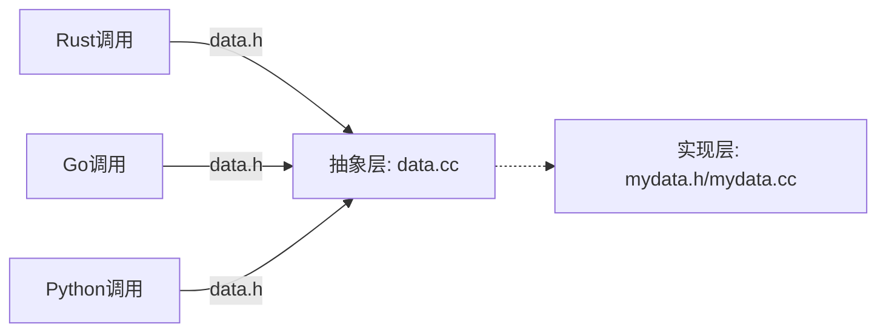

## 关于 `extern "C"`的作用

C++导出函数给其他语言使用必须使用`C语言`格式的函数,

-   原因: C++`函数名`在编译之后会被破坏，以支持重载和多态，而 C 语言的编译之后的`函数名`保持一致
    -   了解更多： https://www.cnblogs.com/xiangtingshen/p/10980055.html

```cpp

#ifndef __XXXX_H
#define  __XXXX_H


#ifdef __cplusplus
extern "C" {
#endif

// 需要导出的C++函数
// ...

#ifdef __cplusplus
}
#endif


#endif // __XXXX_H

```

## 如何解决 C++中 class 的导出问题

因为 C++的函数只能以 C 语言的格式导出，即使用`extern "C"` , 那么如何处理 类方法的导出？

**解决方案： 增加一个中间层(抽象层)**

例如， C++的`class MyData`实现了细节， 那么可以增加一个 C 语言风格的结构体指针 `struct Data`，利用 Data 将 MyData 的方法实现封装(wrapper)

示例代码:

`mydata.h`:

```cpp
class MyData {
    //...
    void doSomething();
}
```

`mydata.cc`

```cpp
#include "mydata.h"
void MyData::doSomething()
{
    // doSomething
}

```

封装抽象层: `data.h`

```cpp

#ifndef __DATA_H
#define __DATA_H

#ifdef __cplusplus
extern "C" {
#endif
    typedef struct Data Data;
    // 导出的函数
    void doSomething(Data *p);
#ifdef __cplusplus
}
#endif

#endif // __DATA_H

```

`data.cc` 对调用不可见

```cpp
void doSomething(Data *p)
{
    //...

    // 指针类型转换, 对调用不可见
    ((MyData *)p)->doSomething();
}

```


示意图:




详细代码:

https://github.com/youngqqcn/call-cpp-dylib/